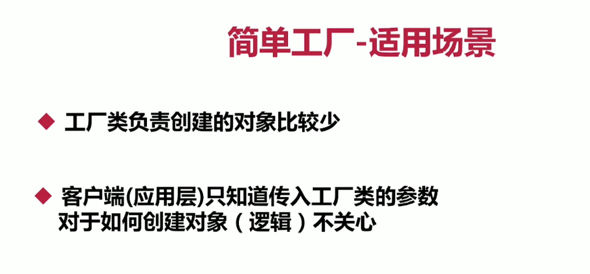
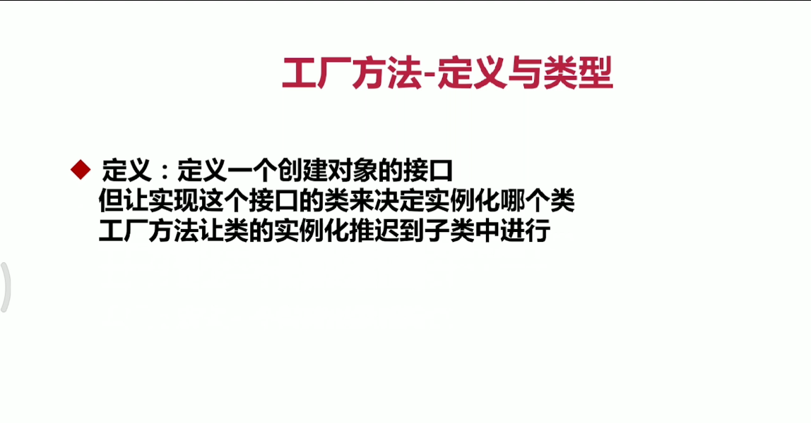
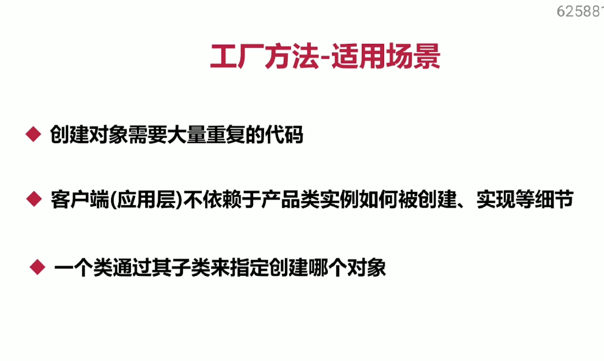
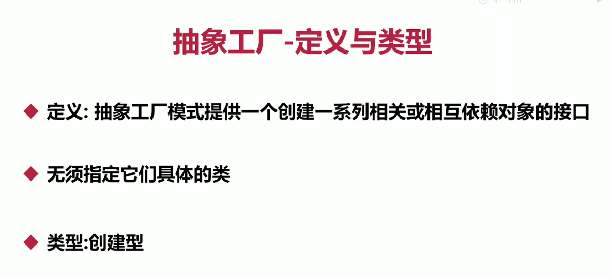
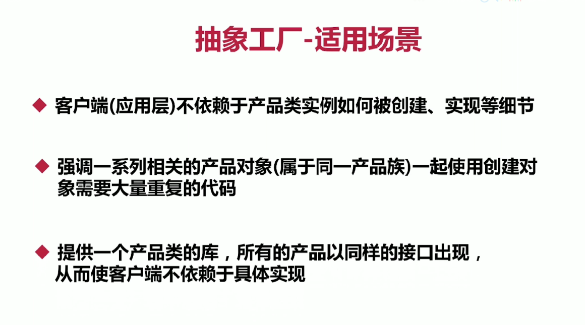

1.开闭原则:在openclose包下，业务增加在应用层修改，通过继承基类，避免修改基类ICourse接口，因为越底层，
越基础的模块变化，影响的范围越大
2.依赖导致原则：在denpenceinversion包下
3.单一职责原理：指的是类，接口和方法的职责是单一的，强调的是职责，只要职责是单一的，有多个方法也是可以的
 在singleresponsibility包下，减低类的复杂度，提高类的可维护性，变更时风险率降低，可读性
4.接口隔离原则：注重的是对接口依赖的隔离，注意适度原则，一定要适度
5.迪米特原则（最少知道原则）：一个对象应该对其他对象保持最少的了解，又叫最少知道原则。尽量降低类与类之间的耦合
6.简单工厂
7.工厂方法：针对的是产品等级，，使用场景：
8.抽象工厂：定义：抽象工厂模式提供一个创建一系列相关或相互依赖对象的接口
抽象工厂使用场景：针对的是同一产品族
,